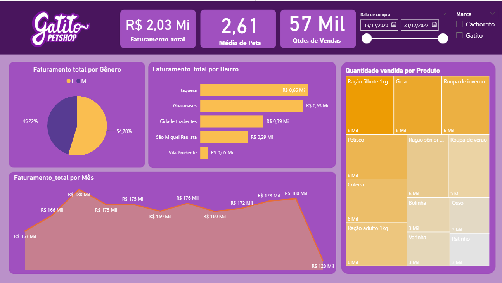

# Power BI: Petshop Analysis :

## 1 - Importando os dados clientes para o seu Power BI o arquivo Clientes.txt:

- O arquivo se encontra na pasta files .
- Basta criar um projeto em branco e fazer a ingestão desse. 
- Escolha 1252: Europeu Ocidental Windows. 
- Depois clique em transformar os dados . 

## 2 - Transformações (No Power Query) :

### 2.1 - Caso seja necessário clique em usar a primeira linha como cabeçalho. 
### 2.2 - Os formatos devem ser (transforme se necessário): 
```
ID Consumidor : Inteiro; 
Gênero : Texto ,
Estado Civil: Text, 
Pets : Inteiro,
Bairro: Text;
```
### 2.3 Depois clique em fechar e aplicar 

## 3 - Importar vendas :
- A pasta vendas se encontra dentro da nossa pasta files.

### 3.1 Clique em obter dados, e depois importar pasta e importe nossa pasta vendas .
### 3.2 Clique em combinar -> Combinar e transformar dados.
### 3.3 Agora vamos dar Drop na coluna 'Nome da Origem'.
### 3.4 Clique em fechar e aplicar .

## 4 - Conectando com o google planilhas. 
### 4.1 - Clique em obter dados -> Web e cole o link abaixo : 
```
https://docs.google.com/spreadsheets/d/e/2PACX-1vQuBG-JoWaeQF5rF3RgZYl5Z-PaJyDBK1I1c8a56RssNGoOlInqQROKi3z54u74E2ei32p_SWOpBb0v/pubhtml/sheet?headers=false&gid=0
```
### 4.2 Selecione a Tabela 1 apenas e transformar dados. 
### 4.3 Renomeei a tabela para Produtos. 
### 4.4 Como a primeira linha esta vazia, vamos clicar em remover linhas superiores (e remover apenas 1) .
### 4.5 Vamos clicar em usar a primeira linha como cabeçalho .
### 4.6 Vamos droppar a primeira coluna que foram ids gerados. 

## 5 - Criando relacionamento entre (Clientes - Vendas).
### 5.1 - Vamos em transformar dados, e remover nulls da coluna ID Consumidor na tabela clientes.
### 5.2 - Agora na parte de relacionamentos, arraste ID Consumidor(Clientes) para ID Consumidor(Vendas) e clique salvar .

## 6 - Criando colunas necessárias (com relacionamento), na tabela vendas .
### 6.1 Em modo exibição clique em criar coluna, e vamos usar a formula : 
```
Valor_unitario:
Valor_unitario = RELATED(Produtos[Valor])
Faturamento: 
Faturamento = 'Vendas'[Quantidade] * 'Vendas'[Valor_unitario]
```

## 7 - Criando nova medida 'Faturamento_total'. 
```
Na tabela vendas coloque a formula : 
Faturamento_total = SUM('Vendas'[Faturamento])
```
## 8 - O arquivo BI pronto é o Pwbi.pbix.


## 9 - Exemplo : 
### Dashboard - PC

### Dashboard - Celular (img 1)


### Dashboard - Celular (img 2)
